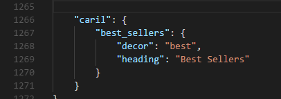
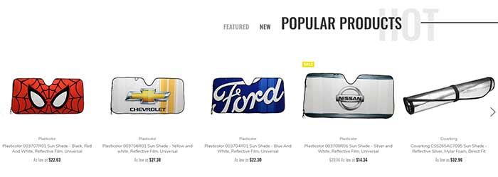

<div ng-app="app">
  <!-- Modal -->
  <div class="modal fade" id="bannersBlockHome01Modal" tabindex="-1" role="dialog" aria-labelledby="bannersBlockHome01ModalLabel">
    <div class="modal-dialog" role="document">
      <div class="modal-content">
        <div class="modal-header">
          <button type="button" class="close" data-dismiss="modal" aria-label="Close"><span aria-hidden="true">&times;</span></button>
          <h4 class="modal-title" id="bannersBlockHome01ModalLabel">Code Generator: Banners Block Home 01</h4>
        </div>
        <div class="modal-body">
          <form>
                <div class="panel-group" id="bannersBlockHome01Accordion" role="tablist" aria-multiselectable="true">
                  <div class="panel panel-default">
                    <div class="panel-heading" role="tab" id="bannersBlockHome01Banner1Heading">
                      <h4 class="panel-title">
                        <a role="button" data-toggle="collapse" data-parent="#bannersBlockHome01Accordion" href="#bannersBlockHome01Banner1Collapse" aria-expanded="true" aria-controls="bannersBlockHome01Banner1Collapse">
                          Banner 1
                        </a>
                      </h4>
                    </div>
                    <div id="bannersBlockHome01Banner1Collapse" class="panel-collapse collapse in" role="tabpanel" aria-labelledby="bannersBlockHome01Banner1Heading">
                      <div class="panel-body">
                        <div class="form-group">
                          <label for="bannersBlockHome01Banner1Img">Image URL:</label>
                          <input ng-model="banner1_img" type="text" class="form-control" id="bannersBlockHome01Banner1Img" placeholder="Example: https://tvlgiao.github.io/bigcommerce-themes/supermarket/demo/images/banner01.jpg">
                        </div>
                        <div class="form-group">
                          <label for="bannersBlockHome01Banner1Alt">Image Alt:</label>
                          <input ng-model="banner1_alt" type="text" class="form-control" id="bannersBlockHome01Banner1Alt" placeholder="Example: Banner 1">
                        </div>
                        <div class="form-group">
                          <label for="bannersBlockHome01Banner1Link">Link URL:</label>
                          <input ng-model="banner1_link" type="text" class="form-control" id="bannersBlockHome01Banner1Link" placeholder="Example: https://supermarket-blue-demo.mybigcommerce.com">
                        </div>
                      </div>
                    </div>
                  </div>
                  <div class="panel panel-default">
                    <div class="panel-heading" role="tab" id="bannersBlockHome01Banner2Heading">
                      <h4 class="panel-title">
                        <a class="collapsed" role="button" data-toggle="collapse" data-parent="#bannersBlockHome01Accordion" href="#bannersBlockHome01Banner2Collapse" aria-expanded="false" aria-controls="bannersBlockHome01Banner2Collapse">
                          Banner 2
                        </a>
                      </h4>
                    </div>
                    <div id="bannersBlockHome01Banner2Collapse" class="panel-collapse collapse" role="tabpanel" aria-labelledby="bannersBlockHome01Banner2Heading">
                      <div class="panel-body">
                        <div class="form-group">
                          <label for="bannersBlockHome01Banner2Img">Image URL:</label>
                          <input ng-model="banner2_img" type="text" class="form-control" id="bannersBlockHome01Banner2Img" placeholder="Example: https://tvlgiao.github.io/bigcommerce-themes/supermarket/demo/images/banner01.jpg">
                        </div>
                        <div class="form-group">
                          <label for="bannersBlockHome01Banner2Alt">Image Alt:</label>
                          <input ng-model="banner2_alt" type="text" class="form-control" id="bannersBlockHome01Banner2Alt" placeholder="Example: Banner 1">
                        </div>
                        <div class="form-group">
                          <label for="bannersBlockHome01Banner2Link">Link URL:</label>
                          <input ng-model="banner2_link" type="text" class="form-control" id="bannersBlockHome01Banner2Link" placeholder="Example: https://supermarket-blue-demo.mybigcommerce.com">
                        </div>
                      </div>
                    </div>
                  </div>
                  <div class="panel panel-default">
                    <div class="panel-heading" role="tab" id="bannersBlockHome01Banner3Heading">
                      <h4 class="panel-title">
                        <a class="collapsed" role="button" data-toggle="collapse" data-parent="#bannersBlockHome01Accordion" href="#bannersBlockHome01Banner3Collapse" aria-expanded="false" aria-controls="bannersBlockHome01Banner3Collapse">
                          Banner 3
                        </a>
                      </h4>
                    </div>
                    <div id="bannersBlockHome01Banner3Collapse" class="panel-collapse collapse" role="tabpanel" aria-labelledby="bannersBlockHome01Banner3Heading">
                      <div class="panel-body">
                        <div class="form-group">
                          <label for="bannersBlockHome01Banner3Img">Image URL:</label>
                          <input ng-model="banner3_img" type="text" class="form-control" id="bannersBlockHome01Banner3Img" placeholder="Example: https://tvlgiao.github.io/bigcommerce-themes/supermarket/demo/images/banner01.jpg">
                        </div>
                        <div class="form-group">
                          <label for="bannersBlockHome01Banner3Alt">Image Alt:</label>
                          <input ng-model="banner3_alt" type="text" class="form-control" id="bannersBlockHome01Banner3Alt" placeholder="Example: Banner 1">
                        </div>
                        <div class="form-group">
                          <label for="bannersBlockHome01Banner3Link">Link URL:</label>
                          <input ng-model="banner3_link" type="text" class="form-control" id="bannersBlockHome01Banner3Link" placeholder="Example: https://supermarket-blue-demo.mybigcommerce.com">
                        </div>
                      </div>
                    </div>
                  </div>
                </div>
                <div hljs include="'/samples/bannersBlockHome01.txt'" compile="true" id="bannersBlockHome01Code" class="highlight-code"></div>
          </form>
        </div>
        <div class="modal-footer">
          <button type="button" class="btn btn-default" data-dismiss="modal">Close</button>
          <button type="button" class="btn btn-primary" data-clipboard-target="#bannersBlockHome01Code">Copy Code</button>
        </div>
      </div>
    </div>
  </div><!-- modal #bannersBlockHome01Modal -->
  <!-- Modal -->
  <div class="modal fade" id="bannersBlockHome02Modal" tabindex="-1" role="dialog" aria-labelledby="bannersBlockHome02ModalLabel">
    <div class="modal-dialog" role="document">
      <div class="modal-content">
        <div class="modal-header">
          <button type="button" class="close" data-dismiss="modal" aria-label="Close"><span aria-hidden="true">&times;</span></button>
          <h4 class="modal-title" id="bannersBlockHome02ModalLabel">Code Generator: Banners Block Home 02</h4>
        </div>
        <div class="modal-body">
          <form>
                <div class="panel-group" id="bannersBlockHome02Accordion" role="tablist" aria-multiselectable="true">
                  <div class="panel panel-default">
                    <div class="panel-heading" role="tab" id="bannersBlockHome02BannerHeading">
                      <h4 class="panel-title">
                        <a role="button" data-toggle="collapse" data-parent="#bannersBlockHome02Accordion" href="#bannersBlockHome02BannerCollapse" aria-expanded="true" aria-controls="bannersBlockHome02BannerCollapse">
                          Banner
                        </a>
                      </h4>
                    </div>
                    <div id="bannersBlockHome02BannerCollapse" class="panel-collapse collapse in" role="tabpanel" aria-labelledby="bannersBlockHome02BannerHeading">
                      <div class="panel-body">
                        <div class="form-group">
                          <label for="bannersBlockHome02BannerImg">Image URL:</label>
                          <input ng-model="banner_img" type="text" class="form-control" id="bannersBlockHome02BannerImg" placeholder="Example: https://tvlgiao.github.io/bigcommerce-themes/supermarket/demo/images/banner04.jpg">
                        </div>
                        <div class="form-group">
                          <label for="bannersBlockHome02BannerAlt">Image Alt:</label>
                          <input ng-model="banner_alt" type="text" class="form-control" id="bannersBlockHome02BannerAlt" placeholder="Example: Banner 1">
                        </div>
                        <div class="form-group">
                          <label for="bannersBlockHome02BannerLink">Link URL:</label>
                          <input ng-model="banner_link" type="text" class="form-control" id="bannersBlockHome02BannerLink" placeholder="Example: https://supermarket-blue-demo.mybigcommerce.com">
                        </div>
                      </div>
                    </div>
                  </div>
                </div>
                <div hljs include="'/samples/bannersBlockHome02.txt'" compile="true" id="bannersBlockHome02Code" class="highlight-code"></div>
          </form>
        </div>
        <div class="modal-footer">
          <button type="button" class="btn btn-default" data-dismiss="modal">Close</button>
          <button type="button" class="btn btn-primary" data-clipboard-target="#bannersBlockHome02Code">Copy Code</button>
        </div>
      </div>
    </div>
  </div><!-- modal #bannersBlockHome02Modal -->
  <!-- Modal -->
  <div class="modal fade" id="bannersBlockHome03Modal" tabindex="-1" role="dialog" aria-labelledby="bannersBlockHome03ModalLabel">
    <div class="modal-dialog" role="document">
      <div class="modal-content">
        <div class="modal-header">
          <button type="button" class="close" data-dismiss="modal" aria-label="Close"><span aria-hidden="true">&times;</span></button>
          <h4 class="modal-title" id="bannersBlockHome03ModalLabel">Code Generator: Banners Block Home 03</h4>
        </div>
        <div class="modal-body">
          <form>
                <div class="panel-group" id="bannersBlockHome03Accordion" role="tablist" aria-multiselectable="true">
                  <div class="panel panel-default">
                    <div class="panel-heading" role="tab" id="bannersBlockHome03Banner1Heading">
                      <h4 class="panel-title">
                        <a role="button" data-toggle="collapse" data-parent="#bannersBlockHome03Accordion" href="#bannersBlockHome03Banner1Collapse" aria-expanded="true" aria-controls="bannersBlockHome03Banner1Collapse">
                          Banner 1
                        </a>
                      </h4>
                    </div>
                    <div id="bannersBlockHome03Banner1Collapse" class="panel-collapse collapse in" role="tabpanel" aria-labelledby="bannersBlockHome03Banner1Heading">
                      <div class="panel-body">
                        <div class="form-group">
                          <label for="bannersBlockHome03Banner1Img">Image URL:</label>
                          <input ng-model="banner1_img" type="text" class="form-control" id="bannersBlockHome03Banner1Img" placeholder="Example: https://tvlgiao.github.io/bigcommerce-themes/supermarket/demo/images/banner01.jpg">
                        </div>
                        <div class="form-group">
                          <label for="bannersBlockHome03Banner1Alt">Image Alt:</label>
                          <input ng-model="banner1_alt" type="text" class="form-control" id="bannersBlockHome03Banner1Alt" placeholder="Example: Banner 1">
                        </div>
                        <div class="form-group">
                          <label for="bannersBlockHome03Banner1Link">Link URL:</label>
                          <input ng-model="banner1_link" type="text" class="form-control" id="bannersBlockHome03Banner1Link" placeholder="Example: https://supermarket-blue-demo.mybigcommerce.com">
                        </div>
                      </div>
                    </div>
                  </div>
                  <div class="panel panel-default">
                    <div class="panel-heading" role="tab" id="bannersBlockHome03Banner2Heading">
                      <h4 class="panel-title">
                        <a class="collapsed" role="button" data-toggle="collapse" data-parent="#bannersBlockHome03Accordion" href="#bannersBlockHome03Banner2Collapse" aria-expanded="false" aria-controls="bannersBlockHome03Banner2Collapse">
                          Banner 2
                        </a>
                      </h4>
                    </div>
                    <div id="bannersBlockHome03Banner2Collapse" class="panel-collapse collapse" role="tabpanel" aria-labelledby="bannersBlockHome03Banner2Heading">
                      <div class="panel-body">
                        <div class="form-group">
                          <label for="bannersBlockHome03Banner2Img">Image URL:</label>
                          <input ng-model="banner2_img" type="text" class="form-control" id="bannersBlockHome03Banner2Img" placeholder="Example: https://tvlgiao.github.io/bigcommerce-themes/supermarket/demo/images/banner01.jpg">
                        </div>
                        <div class="form-group">
                          <label for="bannersBlockHome03Banner2Alt">Image Alt:</label>
                          <input ng-model="banner2_alt" type="text" class="form-control" id="bannersBlockHome03Banner2Alt" placeholder="Example: Banner 1">
                        </div>
                        <div class="form-group">
                          <label for="bannersBlockHome03Banner2Link">Link URL:</label>
                          <input ng-model="banner2_link" type="text" class="form-control" id="bannersBlockHome03Banner2Link" placeholder="Example: https://supermarket-blue-demo.mybigcommerce.com">
                        </div>
                      </div>
                    </div>
                  </div>
                  <div class="panel panel-default">
                    <div class="panel-heading" role="tab" id="bannersBlockHome03Banner3Heading">
                      <h4 class="panel-title">
                        <a class="collapsed" role="button" data-toggle="collapse" data-parent="#bannersBlockHome03Accordion" href="#bannersBlockHome03Banner3Collapse" aria-expanded="false" aria-controls="bannersBlockHome03Banner3Collapse">
                          Banner 3
                        </a>
                      </h4>
                    </div>
                    <div id="bannersBlockHome03Banner3Collapse" class="panel-collapse collapse" role="tabpanel" aria-labelledby="bannersBlockHome03Banner3Heading">
                      <div class="panel-body">
                        <div class="form-group">
                          <label for="bannersBlockHome03Banner3Img">Image URL:</label>
                          <input ng-model="banner3_img" type="text" class="form-control" id="bannersBlockHome03Banner3Img" placeholder="Example: https://tvlgiao.github.io/bigcommerce-themes/supermarket/demo/images/banner01.jpg">
                        </div>
                        <div class="form-group">
                          <label for="bannersBlockHome03Banner3Alt">Image Alt:</label>
                          <input ng-model="banner3_alt" type="text" class="form-control" id="bannersBlockHome03Banner3Alt" placeholder="Example: Banner 1">
                        </div>
                        <div class="form-group">
                          <label for="bannersBlockHome03Banner3Link">Link URL:</label>
                          <input ng-model="banner3_link" type="text" class="form-control" id="bannersBlockHome03Banner3Link" placeholder="Example: https://supermarket-blue-demo.mybigcommerce.com">
                        </div>
                      </div>
                    </div>
                  </div>
                  <div class="panel panel-default">
                    <div class="panel-heading" role="tab" id="bannersBlockHome03Banner4Heading">
                      <h4 class="panel-title">
                        <a class="collapsed" role="button" data-toggle="collapse" data-parent="#bannersBlockHome03Accordion" href="#bannersBlockHome03Banner4Collapse" aria-expanded="false" aria-controls="bannersBlockHome03Banner4Collapse">
                          Banner 4
                        </a>
                      </h4>
                    </div>
                    <div id="bannersBlockHome03Banner4Collapse" class="panel-collapse collapse" role="tabpanel" aria-labelledby="bannersBlockHome03Banner4Heading">
                      <div class="panel-body">
                        <div class="form-group">
                          <label for="bannersBlockHome03Banner4Img">Image URL:</label>
                          <input ng-model="banner4_img" type="text" class="form-control" id="bannersBlockHome03Banner4Img" placeholder="Example: https://tvlgiao.github.io/bigcommerce-themes/laparis/demo/images/brand04.png">
                        </div>
                        <div class="form-group">
                          <label for="bannersBlockHome03Banner4Alt">Image Alt:</label>
                          <input ng-model="banner4_alt" type="text" class="form-control" id="bannersBlockHome03Banner4Alt" placeholder="Example: Banner 4">
                        </div>
                        <div class="form-group">
                          <label for="bannersBlockHome03Banner4Link">Link URL:</label>
                          <input ng-model="banner4_link" type="text" class="form-control" id="bannersBlockHome03Banner4Link" placeholder="Example: https://supermarket-blue-demo.mybigcommerce.com">
                        </div>
                      </div>
                    </div>
                  </div>
                  <div class="panel panel-default">
                    <div class="panel-heading" role="tab" id="bannersBlockHome03Banner5Heading">
                      <h4 class="panel-title">
                        <a class="collapsed" role="button" data-toggle="collapse" data-parent="#bannersBlockHome03Accordion" href="#bannersBlockHome03Banner5Collapse" aria-expanded="false" aria-controls="bannersBlockHome03Banner5Collapse">
                          Banner 5
                        </a>
                      </h4>
                    </div>
                    <div id="bannersBlockHome03Banner5Collapse" class="panel-collapse collapse" role="tabpanel" aria-labelledby="bannersBlockHome03Banner5Heading">
                      <div class="panel-body">
                        <div class="form-group">
                          <label for="bannersBlockHome03Banner5Img">Image URL:</label>
                          <input ng-model="banner5_img" type="text" class="form-control" id="bannersBlockHome03Banner5Img" placeholder="Example: https://tvlgiao.github.io/bigcommerce-themes/laparis/demo/images/brand05.png">
                        </div>
                        <div class="form-group">
                          <label for="bannersBlockHome03Banner5Alt">Image Alt:</label>
                          <input ng-model="banner5_alt" type="text" class="form-control" id="bannersBlockHome03Banner5Alt" placeholder="Example: Banner 5">
                        </div>
                        <div class="form-group">
                          <label for="bannersBlockHome03Banner5Link">Link URL:</label>
                          <input ng-model="banner5_link" type="text" class="form-control" id="bannersBlockHome03Banner5Link" placeholder="Example: https://supermarket-blue-demo.mybigcommerce.com">
                        </div>
                      </div>
                    </div>
                  </div>
                  <div class="panel panel-default">
                    <div class="panel-heading" role="tab" id="bannersBlockHome03Banner6Heading">
                      <h4 class="panel-title">
                        <a class="collapsed" role="button" data-toggle="collapse" data-parent="#bannersBlockHome03Accordion" href="#bannersBlockHome03Banner6Collapse" aria-expanded="false" aria-controls="bannersBlockHome03Banner6Collapse">
                          Banner 6
                        </a>
                      </h4>
                    </div>
                    <div id="bannersBlockHome03Banner6Collapse" class="panel-collapse collapse" role="tabpanel" aria-labelledby="bannersBlockHome03Banner6Heading">
                      <div class="panel-body">
                        <div class="form-group">
                          <label for="bannersBlockHome03Banner6Img">Image URL:</label>
                          <input ng-model="banner6_img" type="text" class="form-control" id="bannersBlockHome03Banner6Img" placeholder="Example: https://tvlgiao.github.io/bigcommerce-themes/laparis/demo/images/brand01.png">
                        </div>
                        <div class="form-group">
                          <label for="bannersBlockHome03Banner6Alt">Image Alt:</label>
                          <input ng-model="banner6_alt" type="text" class="form-control" id="bannersBlockHome03Banner6Alt" placeholder="Example: Banner 6">
                        </div>
                        <div class="form-group">
                          <label for="bannersBlockHome03Banner6Link">Link URL:</label>
                          <input ng-model="banner6_link" type="text" class="form-control" id="bannersBlockHome03Banner6Link" placeholder="Example: https://supermarket-blue-demo.mybigcommerce.com">
                        </div>
                      </div>
                    </div>
                  </div>
                  <div class="panel panel-default">
                    <div class="panel-heading" role="tab" id="bannersBlockHome03Banner7Heading">
                      <h4 class="panel-title">
                        <a class="collapsed" role="button" data-toggle="collapse" data-parent="#bannersBlockHome03Accordion" href="#bannersBlockHome03Banner7Collapse" aria-expanded="false" aria-controls="bannersBlockHome03Banner7Collapse">
                          Banner 7
                        </a>
                      </h4>
                    </div>
                    <div id="bannersBlockHome03Banner7Collapse" class="panel-collapse collapse" role="tabpanel" aria-labelledby="bannersBlockHome03Banner7Heading">
                      <div class="panel-body">
                        <div class="form-group">
                          <label for="bannersBlockHome03Banner7Img">Image URL:</label>
                          <input ng-model="banner7_img" type="text" class="form-control" id="bannersBlockHome03Banner7Img" placeholder="Example: https://tvlgiao.github.io/bigcommerce-themes/laparis/demo/images/brand02.png">
                        </div>
                        <div class="form-group">
                          <label for="bannersBlockHome03Banner7Alt">Image Alt:</label>
                          <input ng-model="banner7_alt" type="text" class="form-control" id="bannersBlockHome03Banner7Alt" placeholder="Example: Banner 7">
                        </div>
                        <div class="form-group">
                          <label for="bannersBlockHome03Banner7Link">Link URL:</label>
                          <input ng-model="banner7_link" type="text" class="form-control" id="bannersBlockHome03Banner7Link" placeholder="Example: https://supermarket-blue-demo.mybigcommerce.com">
                        </div>
                      </div>
                    </div>
                  </div>
                  <div class="panel panel-default">
                    <div class="panel-heading" role="tab" id="bannersBlockHome03Banner8Heading">
                      <h4 class="panel-title">
                        <a class="collapsed" role="button" data-toggle="collapse" data-parent="#bannersBlockHome03Accordion" href="#bannersBlockHome03Banner8Collapse" aria-expanded="false" aria-controls="bannersBlockHome03Banner8Collapse">
                          Banner 8
                        </a>
                      </h4>
                    </div>
                    <div id="bannersBlockHome03Banner8Collapse" class="panel-collapse collapse" role="tabpanel" aria-labelledby="bannersBlockHome03Banner8Heading">
                      <div class="panel-body">
                        <div class="form-group">
                          <label for="bannersBlockHome03Banner8Img">Image URL:</label>
                          <input ng-model="banner8_img" type="text" class="form-control" id="bannersBlockHome03Banner8Img" placeholder="Example: https://tvlgiao.github.io/bigcommerce-themes/laparis/demo/images/brand03.png">
                        </div>
                        <div class="form-group">
                          <label for="bannersBlockHome03Banner8Alt">Image Alt:</label>
                          <input ng-model="banner8_alt" type="text" class="form-control" id="bannersBlockHome03Banner8Alt" placeholder="Example: Banner 8">
                        </div>
                        <div class="form-group">
                          <label for="bannersBlockHome03Banner8Link">Link URL:</label>
                          <input ng-model="banner8_link" type="text" class="form-control" id="bannersBlockHome03Banner8Link" placeholder="Example: https://supermarket-blue-demo.mybigcommerce.com">
                        </div>
                      </div>
                    </div>
                  </div>
                  <div class="panel panel-default">
                    <div class="panel-heading" role="tab" id="bannersBlockHome03Banner9Heading">
                      <h4 class="panel-title">
                        <a class="collapsed" role="button" data-toggle="collapse" data-parent="#bannersBlockHome03Accordion" href="#bannersBlockHome03Banner9Collapse" aria-expanded="false" aria-controls="bannersBlockHome03Banner9Collapse">
                          Banner 9
                        </a>
                      </h4>
                    </div>
                    <div id="bannersBlockHome03Banner9Collapse" class="panel-collapse collapse" role="tabpanel" aria-labelledby="bannersBlockHome03Banner9Heading">
                      <div class="panel-body">
                        <div class="form-group">
                          <label for="bannersBlockHome03Banner9Img">Image URL:</label>
                          <input ng-model="banner9_img" type="text" class="form-control" id="bannersBlockHome03Banner9Img" placeholder="Example: https://tvlgiao.github.io/bigcommerce-themes/laparis/demo/images/brand04.png">
                        </div>
                        <div class="form-group">
                          <label for="bannersBlockHome03Banner9Alt">Image Alt:</label>
                          <input ng-model="banner9_alt" type="text" class="form-control" id="bannersBlockHome03Banner9Alt" placeholder="Example: Banner 9">
                        </div>
                        <div class="form-group">
                          <label for="bannersBlockHome03Banner9Link">Link URL:</label>
                          <input ng-model="banner9_link" type="text" class="form-control" id="bannersBlockHome03Banner9Link" placeholder="Example: https://supermarket-blue-demo.mybigcommerce.com">
                        </div>
                      </div>
                    </div>
                  </div>
                  <div class="panel panel-default">
                    <div class="panel-heading" role="tab" id="bannersBlockHome03Banner10Heading">
                      <h4 class="panel-title">
                        <a class="collapsed" role="button" data-toggle="collapse" data-parent="#bannersBlockHome03Accordion" href="#bannersBlockHome03Banner10Collapse" aria-expanded="false" aria-controls="bannersBlockHome03Banner10Collapse">
                          Banner 10
                        </a>
                      </h4>
                    </div>
                    <div id="bannersBlockHome03Banner10Collapse" class="panel-collapse collapse" role="tabpanel" aria-labelledby="bannersBlockHome03Banner10Heading">
                      <div class="panel-body">
                        <div class="form-group">
                          <label for="bannersBlockHome03Banner10Img">Image URL:</label>
                          <input ng-model="banner10_img" type="text" class="form-control" id="bannersBlockHome03Banner10Img" placeholder="Example: https://tvlgiao.github.io/bigcommerce-themes/laparis/demo/images/brand05.png">
                        </div>
                        <div class="form-group">
                          <label for="bannersBlockHome03Banner10Alt">Image Alt:</label>
                          <input ng-model="banner10_alt" type="text" class="form-control" id="bannersBlockHome03Banner10Alt" placeholder="Example: Banner 10">
                        </div>
                        <div class="form-group">
                          <label for="bannersBlockHome03Banner10Link">Link URL:</label>
                          <input ng-model="banner10_link" type="text" class="form-control" id="bannersBlockHome03Banner10Link" placeholder="Example: https://supermarket-blue-demo.mybigcommerce.com">
                        </div>
                      </div>
                    </div>
                  </div>
                </div>
                <div hljs include="'/samples/bannersBlockHome03.txt'" compile="true" id="bannersBlockHome03Code" class="highlight-code"></div>
          </form>
        </div>
        <div class="modal-footer">
          <button type="button" class="btn btn-default" data-dismiss="modal">Close</button>
          <button type="button" class="btn btn-primary" data-clipboard-target="#bannersBlockHome03Code">Copy Code</button>
        </div>
      </div>
    </div>
  </div><!-- modal #bannersBlockHome03Modal -->
  <!-- Modal -->
  <div class="modal fade" id="bannersBlockSidebarImgModal" tabindex="-1" role="dialog" aria-labelledby="bannersBlockSidebarImgModalLabel">
    <div class="modal-dialog" role="document">
      <div class="modal-content">
        <div class="modal-header">
          <button type="button" class="close" data-dismiss="modal" aria-label="Close"><span aria-hidden="true">&times;</span></button>
          <h4 class="modal-title" id="bannersBlockSidebarImgModalLabel">Code Generator: Banners Block on Sidebar</h4>
        </div>
        <div class="modal-body">
          <form>
                <div class="panel-group" id="bannersBlockSidebarImgAccordion" role="tablist" aria-multiselectable="true">
                  <div class="panel panel-default">
                    <div class="panel-heading" role="tab" id="bannersBlockSidebarImgBannerHeading">
                      <h4 class="panel-title">
                        <a role="button" data-toggle="collapse" data-parent="#bannersBlockSidebarImgAccordion" href="#bannersBlockSidebarImgBannerCollapse" aria-expanded="true" aria-controls="bannersBlockSidebarImgBannerCollapse">
                          Banner
                        </a>
                      </h4>
                    </div>
                    <div id="bannersBlockSidebarImgBannerCollapse" class="panel-collapse collapse in" role="tabpanel" aria-labelledby="bannersBlockSidebarImgBannerHeading">
                      <div class="panel-body">
                        <div class="form-group">
                          <label for="bannersBlockSidebarImgBannerPosition">Position:</label>
                          <select ng-model="banner_position" class="form-control" id="bannersBlockSidebarImgBannerPosition">
                            <option value="01">Before Facebook Block</option>
                            <option value="02">After Facebook Block</option>
                          </select>
                        </div>
                        <div class="form-group">
                          <label for="bannersBlockSidebarImgBannerImg">Image URL:</label>
                          <input ng-model="banner_img" type="text" class="form-control" id="bannersBlockSidebarImgBannerImg" placeholder="Example: https://placehold.it/270x450">
                        </div>
                        <div class="form-group">
                          <label for="bannersBlockSidebarImgBannerAlt">Image Alt:</label>
                          <input ng-model="banner_alt" type="text" class="form-control" id="bannersBlockSidebarImgBannerAlt" placeholder="Example: Banner 1">
                        </div>
                        <div class="form-group">
                          <label for="bannersBlockSidebarImgBannerLink">Link URL:</label>
                          <input ng-model="banner_link" type="text" class="form-control" id="bannersBlockSidebarImgBannerLink" placeholder="Example: https://supermarket-blue-demo.mybigcommerce.com">
                        </div>
                      </div>
                    </div>
                  </div>
                </div>
                <div hljs include="'/samples/bannersBlockSidebarImg.txt'" compile="true" id="bannersBlockSidebarImgCode" class="highlight-code"></div>
          </form>
        </div>
        <div class="modal-footer">
          <button type="button" class="btn btn-default" data-dismiss="modal">Close</button>
          <button type="button" class="btn btn-primary" data-clipboard-target="#bannersBlockSidebarImgCode">Copy Code</button>
        </div>
      </div>
    </div>
  </div><!-- modal #bannersBlockSidebarImgModal -->
  <!-- Modal -->
  <div class="modal fade" id="bannersBlockSidebarTextBlockModal" tabindex="-1" role="dialog" aria-labelledby="bannersBlockSidebarTextBlockModalLabel">
    <div class="modal-dialog" role="document">
      <div class="modal-content">
        <div class="modal-header">
          <button type="button" class="close" data-dismiss="modal" aria-label="Close"><span aria-hidden="true">&times;</span></button>
          <h4 class="modal-title" id="bannersBlockSidebarTextBlockModalLabel">Code Generator: Text Block on Sidebar</h4>
        </div>
        <div class="modal-body">
          <form>
                <div class="panel-group" id="bannersBlockSidebarTextBlockAccordion" role="tablist" aria-multiselectable="true">
                  <div class="panel panel-default">
                    <div class="panel-heading" role="tab" id="bannersBlockSidebarTextBlockPanelHeading">
                      <h4 class="panel-title">
                        <a role="button" data-toggle="collapse" data-parent="#bannersBlockSidebarTextBlockAccordion" href="#bannersBlockSidebarTextBlockCollapse" aria-expanded="true" aria-controls="bannersBlockSidebarTextBlockCollapse">
                          Banner
                        </a>
                      </h4>
                    </div>
                    <div id="bannersBlockSidebarTextBlockCollapse" class="panel-collapse collapse in" role="tabpanel" aria-labelledby="bannersBlockSidebarTextBlockPanelHeading">
                      <div class="panel-body">
                        <div class="form-group">
                          <label for="bannersBlockSidebarTextBlockPosition">Position:</label>
                          <select ng-model="position" class="form-control" id="bannersBlockSidebarTextBlockPosition">
                            <option value="01">Before Facebook Block</option>
                            <option value="02">After Facebook Block</option>
                          </select>
                        </div>
                        <div class="form-group">
                          <label for="bannersBlockSidebarTextBlockHeading">Heading:</label>
                          <input ng-model="heading" type="text" class="form-control" id="bannersBlockSidebarTextBlockHeading" placeholder="Example: Custom Block">
                        </div>
                        <div class="form-group">
                          <label for="bannersBlockSidebarTextBlockBannerContent">Content:</label>
                          <textarea ng-model="content" type="text" class="form-control" id="bannersBlockSidebarTextBlockBannerContent" placeholder="Custom block displayed at the left sidebar. You can put your own content here: text, html, images, media... whatever you like. Here are many similar sample content placeholders across the store. All editable from admin panel. Sample Button"></textarea>
                        </div>
                        <div class="form-group">
                          <label for="bannersBlockSidebarTextBlockButtonText">Button Text:</label>
                          <input ng-model="btn_text" type="text" class="form-control" id="bannersBlockSidebarTextBlockButtonText" placeholder="Example: Sample Button">
                        </div>
                        <div class="form-group">
                          <label for="bannersBlockSidebarTextBlockButtonLink">Button URL:</label>
                          <input ng-model="btn_link" type="text" class="form-control" id="bannersBlockSidebarTextBlockButtonLink" placeholder="Example: https://supermarket-blue-demo.mybigcommerce.com">
                        </div>
                      </div>
                    </div>
                  </div>
                </div>
                <div hljs include="'/samples/bannersBlockSidebarTextBlock.txt'" compile="true" id="bannersBlockSidebarTextBlockCode" class="highlight-code"></div>
          </form>
        </div>
        <div class="modal-footer">
          <button type="button" class="btn btn-default" data-dismiss="modal">Close</button>
          <button type="button" class="btn btn-primary" data-clipboard-target="#bannersBlockSidebarTextBlockCode">Copy Code</button>
        </div>
      </div>
    </div>
  </div><!-- modal #bannersBlockSidebarTextBlockModal -->
  <!-- Modal -->
  <div class="modal fade" id="bannersBlockStaticNavPagesModal" tabindex="-1" role="dialog" aria-labelledby="bannersBlockStaticNavPagesModalLabel">
    <div class="modal-dialog" role="document">
      <div class="modal-content">
        <div class="modal-header">
          <button type="button" class="close" data-dismiss="modal" aria-label="Close"><span aria-hidden="true">&times;</span></button>
          <h4 class="modal-title" id="bannersBlockStaticNavPagesModalLabel">Code Generator: Manual Main Menu</h4>
        </div>
        <div class="modal-body">
          <form>
            <!-- Panel -->
            <div class="panel-group" id="bannersBlockStaticNavPagesAccordion" role="tablist" aria-multiselectable="true">
              <div class="panel panel-default">
                <div class="panel-heading" role="tab" id="bannersBlockStaticNavPagesLink1Heading">
                  <h4 class="panel-title">
                    <a role="button" data-toggle="collapse" data-parent="#bannersBlockStaticNavPagesAccordion" href="#bannersBlockStaticNavPagesLink1Collapse" aria-expanded="true" aria-controls="bannersBlockStaticNavPagesLink1Collapse">
                      Link 1
                    </a>
                  </h4>
                </div>
                <div id="bannersBlockStaticNavPagesLink1Collapse" class="panel-collapse collapse in" role="tabpanel" aria-labelledby="bannersBlockStaticNavPagesLink1Heading">
                  <div class="panel-body">
                    <div class="form-group">
                      <label for="bannersBlockStaticNavPagesLink1Img">Link URL:</label>
                      <input ng-model="link1_url" type="text" class="form-control" id="bannersBlockStaticNavPagesLink1Url" placeholder="Example: /">
                    </div>
                    <div class="form-group">
                      <label for="bannersBlockStaticNavPagesLink1Title">Link Title:</label>
                      <input ng-model="link1_title" type="text" class="form-control" id="bannersBlockStaticNavPagesLink1Title" placeholder="Example: Home">
                    </div>
                  </div>
                </div>
              </div>
            </div>
            <!-- Panel Collapsed -->
            <div class="panel-group" id="bannersBlockStaticNavPagesAccordion" role="tablist" aria-multiselectable="true">
              <div class="panel panel-default">
                <div class="panel-heading" role="tab" id="bannersBlockStaticNavPagesLink2Heading">
                  <h4 class="panel-title">
                    <a class="collapsed" role="button" data-toggle="collapse" data-parent="#bannersBlockStaticNavPagesAccordion" href="#bannersBlockStaticNavPagesLink2Collapse" aria-expanded="false" aria-controls="bannersBlockStaticNavPagesLink2Collapse">
                      Link 2
                    </a>
                  </h4>
                </div>
                <div id="bannersBlockStaticNavPagesLink2Collapse" class="panel-collapse collapse" role="tabpanel" aria-labelledby="bannersBlockStaticNavPagesLink2Heading">
                  <div class="panel-body">
                    <div class="form-group">
                      <label for="bannersBlockStaticNavPagesLink2Img">Link URL:</label>
                      <input ng-model="link2_url" type="text" class="form-control" id="bannersBlockStaticNavPagesLink2Url" placeholder="Example: /about-us">
                    </div>
                    <div class="form-group">
                      <label for="bannersBlockStaticNavPagesLink2Title">Link Title:</label>
                      <input ng-model="link2_title" type="text" class="form-control" id="bannersBlockStaticNavPagesLink2Title" placeholder="Example: About Us">
                    </div>
                  </div>
                </div>
              </div>
            </div>
            <!-- Panel Collapsed -->
            <div class="panel-group" id="bannersBlockStaticNavPagesAccordion" role="tablist" aria-multiselectable="true">
              <div class="panel panel-default">
                <div class="panel-heading" role="tab" id="bannersBlockStaticNavPagesLink3Heading">
                  <h4 class="panel-title">
                    <a class="collapsed" role="button" data-toggle="collapse" data-parent="#bannersBlockStaticNavPagesAccordion" href="#bannersBlockStaticNavPagesLink3Collapse" aria-expanded="false" aria-controls="bannersBlockStaticNavPagesLink3Collapse">
                      Link 3
                    </a>
                  </h4>
                </div>
                <div id="bannersBlockStaticNavPagesLink3Collapse" class="panel-collapse collapse" role="tabpanel" aria-labelledby="bannersBlockStaticNavPagesLink3Heading">
                  <div class="panel-body">
                    <div class="form-group">
                      <label for="bannersBlockStaticNavPagesLink3Img">Link URL:</label>
                      <input ng-model="link3_url" type="text" class="form-control" id="bannersBlockStaticNavPagesLink3Url" placeholder="Example: /contact-us">
                    </div>
                    <div class="form-group">
                      <label for="bannersBlockStaticNavPagesLink3Title">Link Title:</label>
                      <input ng-model="link3_title" type="text" class="form-control" id="bannersBlockStaticNavPagesLink3Title" placeholder="Example: Contact Us">
                    </div>
                  </div>
                </div>
              </div>
            </div>
            <!-- Panel Collapsed -->
            <div class="panel-group" id="bannersBlockStaticNavPagesAccordion" role="tablist" aria-multiselectable="true">
              <div class="panel panel-default">
                <div class="panel-heading" role="tab" id="bannersBlockStaticNavPagesLink4Heading">
                  <h4 class="panel-title">
                    <a class="collapsed" role="button" data-toggle="collapse" data-parent="#bannersBlockStaticNavPagesAccordion" href="#bannersBlockStaticNavPagesLink4Collapse" aria-expanded="false" aria-controls="bannersBlockStaticNavPagesLink4Collapse">
                      Link 4
                    </a>
                  </h4>
                </div>
                <div id="bannersBlockStaticNavPagesLink4Collapse" class="panel-collapse collapse" role="tabpanel" aria-labelledby="bannersBlockStaticNavPagesLink4Heading">
                  <div class="panel-body">
                    <div class="form-group">
                      <label for="bannersBlockStaticNavPagesLink4Img">Link URL:</label>
                      <input ng-model="link4_url" type="text" class="form-control" id="bannersBlockStaticNavPagesLink4Url" placeholder="Example: /link-a">
                    </div>
                    <div class="form-group">
                      <label for="bannersBlockStaticNavPagesLink4Title">Link Title:</label>
                      <input ng-model="link4_title" type="text" class="form-control" id="bannersBlockStaticNavPagesLink4Title" placeholder="Example: Link A">
                    </div>
                  </div>
                </div>
              </div>
            </div>
            <!-- Panel Collapsed -->
            <div class="panel-group" id="bannersBlockStaticNavPagesAccordion" role="tablist" aria-multiselectable="true">
              <div class="panel panel-default">
                <div class="panel-heading" role="tab" id="bannersBlockStaticNavPagesLink5Heading">
                  <h4 class="panel-title">
                    <a class="collapsed" role="button" data-toggle="collapse" data-parent="#bannersBlockStaticNavPagesAccordion" href="#bannersBlockStaticNavPagesLink5Collapse" aria-expanded="false" aria-controls="bannersBlockStaticNavPagesLink5Collapse">
                      Link 5
                    </a>
                  </h4>
                </div>
                <div id="bannersBlockStaticNavPagesLink5Collapse" class="panel-collapse collapse" role="tabpanel" aria-labelledby="bannersBlockStaticNavPagesLink5Heading">
                  <div class="panel-body">
                    <div class="form-group">
                      <label for="bannersBlockStaticNavPagesLink5Img">Link URL:</label>
                      <input ng-model="link5_url" type="text" class="form-control" id="bannersBlockStaticNavPagesLink5Url" placeholder="Example: /link-b">
                    </div>
                    <div class="form-group">
                      <label for="bannersBlockStaticNavPagesLink5Title">Link Title:</label>
                      <input ng-model="link5_title" type="text" class="form-control" id="bannersBlockStaticNavPagesLink5Title" placeholder="Example: Link B">
                    </div>
                  </div>
                </div>
              </div>
            </div>
            <!-- Panel Collapsed -->
            <div class="panel-group" id="bannersBlockStaticNavPagesAccordion" role="tablist" aria-multiselectable="true">
              <div class="panel panel-default">
                <div class="panel-heading" role="tab" id="bannersBlockStaticNavPagesLink6Heading">
                  <h4 class="panel-title">
                    <a class="collapsed" role="button" data-toggle="collapse" data-parent="#bannersBlockStaticNavPagesAccordion" href="#bannersBlockStaticNavPagesLink6Collapse" aria-expanded="false" aria-controls="bannersBlockStaticNavPagesLink6Collapse">
                      Link 6
                    </a>
                  </h4>
                </div>
                <div id="bannersBlockStaticNavPagesLink6Collapse" class="panel-collapse collapse" role="tabpanel" aria-labelledby="bannersBlockStaticNavPagesLink6Heading">
                  <div class="panel-body">
                    <div class="form-group">
                      <label for="bannersBlockStaticNavPagesLink6Img">Link URL:</label>
                      <input ng-model="link6_url" type="text" class="form-control" id="bannersBlockStaticNavPagesLink6Url" placeholder="Example: /link-c">
                    </div>
                    <div class="form-group">
                      <label for="bannersBlockStaticNavPagesLink6Title">Link Title:</label>
                      <input ng-model="link6_title" type="text" class="form-control" id="bannersBlockStaticNavPagesLink6Title" placeholder="Example: Link C">
                    </div>
                  </div>
                </div>
              </div>
            </div>
            <!-- Panel Collapsed -->
            <div class="panel-group" id="bannersBlockStaticNavPagesAccordion" role="tablist" aria-multiselectable="true">
              <div class="panel panel-default">
                <div class="panel-heading" role="tab" id="bannersBlockStaticNavPagesLink7Heading">
                  <h4 class="panel-title">
                    <a class="collapsed" role="button" data-toggle="collapse" data-parent="#bannersBlockStaticNavPagesAccordion" href="#bannersBlockStaticNavPagesLink7Collapse" aria-expanded="false" aria-controls="bannersBlockStaticNavPagesLink7Collapse">
                      Link 7
                    </a>
                  </h4>
                </div>
                <div id="bannersBlockStaticNavPagesLink7Collapse" class="panel-collapse collapse" role="tabpanel" aria-labelledby="bannersBlockStaticNavPagesLink7Heading">
                  <div class="panel-body">
                    <div class="form-group">
                      <label for="bannersBlockStaticNavPagesLink7Img">Link URL:</label>
                      <input ng-model="link7_url" type="text" class="form-control" id="bannersBlockStaticNavPagesLink7Url" placeholder="Example: /link-d">
                    </div>
                    <div class="form-group">
                      <label for="bannersBlockStaticNavPagesLink7Title">Link Title:</label>
                      <input ng-model="link7_title" type="text" class="form-control" id="bannersBlockStaticNavPagesLink7Title" placeholder="Example: Link D">
                    </div>
                  </div>
                </div>
              </div>
            </div>
            <!-- Panel Collapsed -->
            <div class="panel-group" id="bannersBlockStaticNavPagesAccordion" role="tablist" aria-multiselectable="true">
              <div class="panel panel-default">
                <div class="panel-heading" role="tab" id="bannersBlockStaticNavPagesLink8Heading">
                  <h4 class="panel-title">
                    <a class="collapsed" role="button" data-toggle="collapse" data-parent="#bannersBlockStaticNavPagesAccordion" href="#bannersBlockStaticNavPagesLink8Collapse" aria-expanded="false" aria-controls="bannersBlockStaticNavPagesLink8Collapse">
                      Link 8
                    </a>
                  </h4>
                </div>
                <div id="bannersBlockStaticNavPagesLink8Collapse" class="panel-collapse collapse" role="tabpanel" aria-labelledby="bannersBlockStaticNavPagesLink8Heading">
                  <div class="panel-body">
                    <div class="form-group">
                      <label for="bannersBlockStaticNavPagesLink8Img">Link URL:</label>
                      <input ng-model="link8_url" type="text" class="form-control" id="bannersBlockStaticNavPagesLink8Url" placeholder="Example: /link-e">
                    </div>
                    <div class="form-group">
                      <label for="bannersBlockStaticNavPagesLink8Title">Link Title:</label>
                      <input ng-model="link8_title" type="text" class="form-control" id="bannersBlockStaticNavPagesLink8Title" placeholder="Example: Link E">
                    </div>
                  </div>
                </div>
              </div>
            </div>
            <!-- Panel Collapsed -->
            <div class="panel-group" id="bannersBlockStaticNavPagesAccordion" role="tablist" aria-multiselectable="true">
              <div class="panel panel-default">
                <div class="panel-heading" role="tab" id="bannersBlockStaticNavPagesLink9Heading">
                  <h4 class="panel-title">
                    <a class="collapsed" role="button" data-toggle="collapse" data-parent="#bannersBlockStaticNavPagesAccordion" href="#bannersBlockStaticNavPagesLink9Collapse" aria-expanded="false" aria-controls="bannersBlockStaticNavPagesLink9Collapse">
                      Link 9
                    </a>
                  </h4>
                </div>
                <div id="bannersBlockStaticNavPagesLink9Collapse" class="panel-collapse collapse" role="tabpanel" aria-labelledby="bannersBlockStaticNavPagesLink9Heading">
                  <div class="panel-body">
                    <div class="form-group">
                      <label for="bannersBlockStaticNavPagesLink9Img">Link URL:</label>
                      <input ng-model="link9_url" type="text" class="form-control" id="bannersBlockStaticNavPagesLink9Url" placeholder="Example: /link-f">
                    </div>
                    <div class="form-group">
                      <label for="bannersBlockStaticNavPagesLink9Title">Link Title:</label>
                      <input ng-model="link9_title" type="text" class="form-control" id="bannersBlockStaticNavPagesLink9Title" placeholder="Example: Link F">
                    </div>
                  </div>
                </div>
              </div>
            </div>
            <div hljs include="'/samples/bannersBlockStaticNavPages.txt'" compile="true" id="bannersBlockStaticNavPagesCode" class="highlight-code"></div>
          </form>
        </div>
        <div class="modal-footer">
          <button type="button" class="btn btn-default" data-dismiss="modal">Close</button>
          <button type="button" class="btn btn-primary" data-clipboard-target="#bannersBlockStaticNavPagesCode">Copy Code</button>
        </div>
      </div>
    </div>
  </div><!-- modal #bannersBlockStaticNavPagesModal -->
  <!-- Modal -->
  <div class="modal fade" id="bannersBlockAfterHeaderModal" tabindex="-1" role="dialog" aria-labelledby="bannersBlockAfterHeaderModalLabel">
    <div class="modal-dialog" role="document">
      <div class="modal-content">
        <div class="modal-header">
          <button type="button" class="close" data-dismiss="modal" aria-label="Close"><span aria-hidden="true">&times;</span></button>
          <h4 class="modal-title" id="bannersBlockAfterHeaderModalLabel">Code Generator: Banner below header</h4>
        </div>
        <div class="modal-body">
          <form>
                <div class="panel-group" id="bannersBlockAfterHeaderAccordion" role="tablist" aria-multiselectable="true">
                  <div class="panel panel-default">
                    <div class="panel-heading" role="tab" id="bannersBlockAfterHeaderBannerHeading">
                      <h4 class="panel-title">
                        <a role="button" data-toggle="collapse" data-parent="#bannersBlockAfterHeaderAccordion" href="#bannersBlockAfterHeaderBannerCollapse" aria-expanded="true" aria-controls="bannersBlockAfterHeaderBannerCollapse">
                          Banner
                        </a>
                      </h4>
                    </div>
                    <div id="bannersBlockAfterHeaderBannerCollapse" class="panel-collapse collapse in" role="tabpanel" aria-labelledby="bannersBlockAfterHeaderBannerHeading">
                      <div class="panel-body">
                        <div class="form-group">
                          <label for="bannersBlockAfterHeaderBannerImg">Image URL:</label>
                          <input ng-model="banner_img" type="text" class="form-control" id="bannersBlockAfterHeaderBannerImg" placeholder="Example: https://placehold.it/270x450">
                        </div>
                        <div class="form-group">
                          <label for="bannersBlockAfterHeaderBannerAlt">Image Alt:</label>
                          <input ng-model="banner_alt" type="text" class="form-control" id="bannersBlockAfterHeaderBannerAlt" placeholder="Example: Banner 1">
                        </div>
                        <div class="form-group">
                          <label for="bannersBlockAfterHeaderBannerLink">Link URL:</label>
                          <input ng-model="banner_link" type="text" class="form-control" id="bannersBlockAfterHeaderBannerLink" placeholder="Example: https://supermarket-blue-demo.mybigcommerce.com">
                        </div>
                      </div>
                    </div>
                  </div>
                </div>
                <div hljs include="'/samples/bannersBlockAfterHeader.txt'" compile="true" id="bannersBlockAfterHeaderCode" class="highlight-code"></div>
          </form>
        </div>
        <div class="modal-footer">
          <button type="button" class="btn btn-default" data-dismiss="modal">Close</button>
          <button type="button" class="btn btn-primary" data-clipboard-target="#bannersBlockAfterHeaderCode">Copy Code</button>
        </div>
      </div>
    </div>
  </div><!-- modal #bannersBlockAfterHeaderModal -->
  <!-- Modal -->
  <div class="modal fade" id="bannersBlockBeforeCategoryModal" tabindex="-1" role="dialog" aria-labelledby="bannersBlockBeforeCategoryModalLabel">
    <div class="modal-dialog" role="document">
      <div class="modal-content">
        <div class="modal-header">
          <button type="button" class="close" data-dismiss="modal" aria-label="Close"><span aria-hidden="true">&times;</span></button>
          <h4 class="modal-title" id="bannersBlockBeforeCategoryModalLabel">Code Generator: Banner on category page top content</h4>
        </div>
        <div class="modal-body">
          <form>
                <div class="panel-group" id="bannersBlockBeforeCategoryAccordion" role="tablist" aria-multiselectable="true">
                  <div class="panel panel-default">
                    <div class="panel-heading" role="tab" id="bannersBlockBeforeCategoryBannerHeading">
                      <h4 class="panel-title">
                        <a role="button" data-toggle="collapse" data-parent="#bannersBlockBeforeCategoryAccordion" href="#bannersBlockBeforeCategoryBannerCollapse" aria-expanded="true" aria-controls="bannersBlockBeforeCategoryBannerCollapse">
                          Banner
                        </a>
                      </h4>
                    </div>
                    <div id="bannersBlockBeforeCategoryBannerCollapse" class="panel-collapse collapse in" role="tabpanel" aria-labelledby="bannersBlockBeforeCategoryBannerHeading">
                      <div class="panel-body">
                        <div class="form-group">
                          <label for="bannersBlockBeforeCategoryBannerImg">Image URL:</label>
                          <input ng-model="banner_img" type="text" class="form-control" id="bannersBlockBeforeCategoryBannerImg" placeholder="Example: https://placehold.it/270x450">
                        </div>
                        <div class="form-group">
                          <label for="bannersBlockBeforeCategoryBannerAlt">Image Alt:</label>
                          <input ng-model="banner_alt" type="text" class="form-control" id="bannersBlockBeforeCategoryBannerAlt" placeholder="Example: Banner 1">
                        </div>
                        <div class="form-group">
                          <label for="bannersBlockBeforeCategoryBannerLink">Link URL:</label>
                          <input ng-model="banner_link" type="text" class="form-control" id="bannersBlockBeforeCategoryBannerLink" placeholder="Example: https://supermarket-blue-demo.mybigcommerce.com">
                        </div>
                      </div>
                    </div>
                  </div>
                </div>
                <div hljs include="'/samples/bannersBlockBeforeCategory.txt'" compile="true" id="bannersBlockBeforeCategoryCode" class="highlight-code"></div>
          </form>
        </div>
        <div class="modal-footer">
          <button type="button" class="btn btn-default" data-dismiss="modal">Close</button>
          <button type="button" class="btn btn-primary" data-clipboard-target="#bannersBlockBeforeCategoryCode">Copy Code</button>
        </div>
      </div>
    </div>
  </div><!-- modal #bannersBlockBeforeCategoryModal -->
  <!-- Modal -->
  <div class="modal fade" id="bannersBlockAfterRatingModal" tabindex="-1" role="dialog" aria-labelledby="bannersBlockAfterRatingModalLabel">
    <div class="modal-dialog" role="document">
      <div class="modal-content">
        <div class="modal-header">
          <button type="button" class="close" data-dismiss="modal" aria-label="Close"><span aria-hidden="true">&times;</span></button>
          <h4 class="modal-title" id="bannersBlockAfterRatingModalLabel">Code Generator: Banner below ratings</h4>
        </div>
        <div class="modal-body">
          <form>
                <div class="panel-group" id="bannersBlockAfterRatingAccordion" role="tablist" aria-multiselectable="true">
                  <div class="panel panel-default">
                    <div class="panel-heading" role="tab" id="bannersBlockAfterRatingBannerHeading">
                      <h4 class="panel-title">
                        <a role="button" data-toggle="collapse" data-parent="#bannersBlockAfterRatingAccordion" href="#bannersBlockAfterRatingBannerCollapse" aria-expanded="true" aria-controls="bannersBlockAfterRatingBannerCollapse">
                          Banner
                        </a>
                      </h4>
                    </div>
                    <div id="bannersBlockAfterRatingBannerCollapse" class="panel-collapse collapse in" role="tabpanel" aria-labelledby="bannersBlockAfterRatingBannerHeading">
                      <div class="panel-body">
                        <div class="form-group">
                          <label for="bannersBlockAfterRatingBannerImg">Image URL:</label>
                          <input ng-model="banner_img" type="text" class="form-control" id="bannersBlockAfterRatingBannerImg" placeholder="Example: https://placehold.it/270x450">
                        </div>
                        <div class="form-group">
                          <label for="bannersBlockAfterRatingBannerAlt">Image Alt:</label>
                          <input ng-model="banner_alt" type="text" class="form-control" id="bannersBlockAfterRatingBannerAlt" placeholder="Example: Banner 1">
                        </div>
                        <div class="form-group">
                          <label for="bannersBlockAfterRatingBannerLink">Link URL:</label>
                          <input ng-model="banner_link" type="text" class="form-control" id="bannersBlockAfterRatingBannerLink" placeholder="Example: https://supermarket-blue-demo.mybigcommerce.com">
                        </div>
                      </div>
                    </div>
                  </div>
                </div>
                <div hljs include="'/samples/bannersBlockAfterRating.txt'" compile="true" id="bannersBlockAfterRatingCode" class="highlight-code"></div>
          </form>
        </div>
        <div class="modal-footer">
          <button type="button" class="btn btn-default" data-dismiss="modal">Close</button>
          <button type="button" class="btn btn-primary" data-clipboard-target="#bannersBlockAfterRatingCode">Copy Code</button>
        </div>
      </div>
    </div>
  </div><!-- modal #bannersBlockAfterRatingModal -->
  <!-- Modal -->
  <div class="modal fade" id="bannersBlockAfterAddToCartButtonModal" tabindex="-1" role="dialog" aria-labelledby="bannersBlockAfterAddToCartButtonModalLabel">
    <div class="modal-dialog" role="document">
      <div class="modal-content">
        <div class="modal-header">
          <button type="button" class="close" data-dismiss="modal" aria-label="Close"><span aria-hidden="true">&times;</span></button>
          <h4 class="modal-title" id="bannersBlockAfterAddToCartButtonModalLabel">Code Generator: Banner below Add To Cart button</h4>
        </div>
        <div class="modal-body">
          <form>
                <div class="panel-group" id="bannersBlockAfterAddToCartButtonAccordion" role="tablist" aria-multiselectable="true">
                  <div class="panel panel-default">
                    <div class="panel-heading" role="tab" id="bannersBlockAfterAddToCartButtonBannerHeading">
                      <h4 class="panel-title">
                        <a role="button" data-toggle="collapse" data-parent="#bannersBlockAfterAddToCartButtonAccordion" href="#bannersBlockAfterAddToCartButtonBannerCollapse" aria-expanded="true" aria-controls="bannersBlockAfterAddToCartButtonBannerCollapse">
                          Banner
                        </a>
                      </h4>
                    </div>
                    <div id="bannersBlockAfterAddToCartButtonBannerCollapse" class="panel-collapse collapse in" role="tabpanel" aria-labelledby="bannersBlockAfterAddToCartButtonBannerHeading">
                      <div class="panel-body">
                        <div class="form-group">
                          <label for="bannersBlockAfterAddToCartButtonBannerImg">Image URL:</label>
                          <input ng-model="banner_img" type="text" class="form-control" id="bannersBlockAfterAddToCartButtonBannerImg" placeholder="Example: https://placehold.it/270x450">
                        </div>
                        <div class="form-group">
                          <label for="bannersBlockAfterAddToCartButtonBannerAlt">Image Alt:</label>
                          <input ng-model="banner_alt" type="text" class="form-control" id="bannersBlockAfterAddToCartButtonBannerAlt" placeholder="Example: Banner 1">
                        </div>
                        <div class="form-group">
                          <label for="bannersBlockAfterAddToCartButtonBannerLink">Link URL:</label>
                          <input ng-model="banner_link" type="text" class="form-control" id="bannersBlockAfterAddToCartButtonBannerLink" placeholder="Example: https://supermarket-blue-demo.mybigcommerce.com">
                        </div>
                      </div>
                    </div>
                  </div>
                </div>
                <div hljs include="'/samples/bannersBlockAfterAddToCartButton.txt'" compile="true" id="bannersBlockAfterAddToCartButtonCode" class="highlight-code"></div>
          </form>
        </div>
        <div class="modal-footer">
          <button type="button" class="btn btn-default" data-dismiss="modal">Close</button>
          <button type="button" class="btn btn-primary" data-clipboard-target="#bannersBlockAfterAddToCartButtonCode">Copy Code</button>
        </div>
      </div>
    </div>
  </div><!-- modal #bannersBlockAfterAddToCartButtonModal -->
  <!-- Modal -->
  <div class="modal fade" id="bannersBlockBeforeDescriptionModal" tabindex="-1" role="dialog" aria-labelledby="bannersBlockBeforeDescriptionModalLabel">
    <div class="modal-dialog" role="document">
      <div class="modal-content">
        <div class="modal-header">
          <button type="button" class="close" data-dismiss="modal" aria-label="Close"><span aria-hidden="true">&times;</span></button>
          <h4 class="modal-title" id="bannersBlockBeforeDescriptionModalLabel">Code Generator: Banner above description tabs</h4>
        </div>
        <div class="modal-body">
          <form>
                <div class="panel-group" id="bannersBlockBeforeDescriptionAccordion" role="tablist" aria-multiselectable="true">
                  <div class="panel panel-default">
                    <div class="panel-heading" role="tab" id="bannersBlockBeforeDescriptionBannerHeading">
                      <h4 class="panel-title">
                        <a role="button" data-toggle="collapse" data-parent="#bannersBlockBeforeDescriptionAccordion" href="#bannersBlockBeforeDescriptionBannerCollapse" aria-expanded="true" aria-controls="bannersBlockBeforeDescriptionBannerCollapse">
                          Banner
                        </a>
                      </h4>
                    </div>
                    <div id="bannersBlockBeforeDescriptionBannerCollapse" class="panel-collapse collapse in" role="tabpanel" aria-labelledby="bannersBlockBeforeDescriptionBannerHeading">
                      <div class="panel-body">
                        <div class="form-group">
                          <label for="bannersBlockBeforeDescriptionBannerImg">Image URL:</label>
                          <input ng-model="banner_img" type="text" class="form-control" id="bannersBlockBeforeDescriptionBannerImg" placeholder="Example: https://placehold.it/270x450">
                        </div>
                        <div class="form-group">
                          <label for="bannersBlockBeforeDescriptionBannerAlt">Image Alt:</label>
                          <input ng-model="banner_alt" type="text" class="form-control" id="bannersBlockBeforeDescriptionBannerAlt" placeholder="Example: Banner 1">
                        </div>
                        <div class="form-group">
                          <label for="bannersBlockBeforeDescriptionBannerLink">Link URL:</label>
                          <input ng-model="banner_link" type="text" class="form-control" id="bannersBlockBeforeDescriptionBannerLink" placeholder="Example: https://supermarket-blue-demo.mybigcommerce.com">
                        </div>
                      </div>
                    </div>
                  </div>
                </div>
                <div hljs include="'/samples/bannersBlockBeforeDescription.txt'" compile="true" id="bannersBlockBeforeDescriptionCode" class="highlight-code"></div>
          </form>
        </div>
        <div class="modal-footer">
          <button type="button" class="btn btn-default" data-dismiss="modal">Close</button>
          <button type="button" class="btn btn-primary" data-clipboard-target="#bannersBlockBeforeDescriptionCode">Copy Code</button>
        </div>
      </div>
    </div>
  </div><!-- modal #bannersBlockBeforeDescriptionModal -->
</div>


# Customization

## Header


* Top promotion banner can be added in **Marketing** > **Banners**, choose display location is **Top of Page**.
* Address and phone number can be edited in **Store Setup** > **Store Profile**.
* You can change colors, typography and customize header in **Theme Editor** > **Header**.
* You can also toggle on/off page links in **Theme Editor** > **Header** > **Page navigation** > **Hide Content Pages in Main Menu**.


## Multi-tier Categories for Vehicle Filter


To enable this multi-tier categories filter bar, go to **Theme Editor** > **Products**, enter the parent category ID in text box **Category ID of Vehicle Filter**:


Below is an example for how to organize categories used for vehicle filter:


Next step, go to **Store Settup** > **Store Settings** > **Display** tab, in **Category Settings** panel, choose **Menu Display Depth** = `4` or higher.

To change labels like `Select your vehicle`, `Select Make`, `Select Year`, `Select Model`... you can edit the language file `lang/en.json`, edit text in section `vehicle_filter` as showing below:


## Main Carousel


* You can edit main carousel slides in **Storefront** > **Home Page Carousel**.
* Change colors in **Theme Editor** > **Carousel**.


## 2 Banners beside the main carousel


To show these banners on homepage, from your admin page > __Marketing__ > __Banners __> click button __Create a Banner__. In field __Banner Content__, click button HTML to open __HTML Source Editor__, input content below:


```html
<div id="emthemesModezBannersBlockHomeCarouselSidebar" class="papaAprilCar-mainCarousel-sidebar">
  <div class="papaAprilCar-mainCarousel-sidebar-banner"><a href="#"></a></div>
  <div class="papaAprilCar-mainCarousel-sidebar-banner"><a href="#"></a></div>
</div>
```


Then click __Update__ button to go back previous screen.

Choose __Show on Page__ is __Home Page__.

Choose __Location__ is __Top of Page__.


Click __Save__ button to finish.

You can freely edit the HTML above to change banner images or link but keep the HTML attribute `id="emthemesModezBannersBlockHomeCarouselSidebar"` unchanged.


## Best products by categories


* Automatically display products by category. Each category organized in tab.
* By default it limits 5 categories. You can change this number by editing file `templates\components\papa-april-car\category\ajax-products-by-categories-tabs.html` change number in `limit categories 5`.
* By default it display 8 products per tab. You can change this number by editing file `templates\components\papa-april-car\category\ajax-products-by-category-tabs-result.html` change number in `limit category.products 8`.
* You can change text `Best` and `Best Sellers` by editing file `lang/en.json`:

* You can change product colors, badget style and other settings in **Theme Editor** > **Products**.


## Countdown banner section


To display this banner on homepage, create a new banner in **Marketing** > **Banners**.

* Input content below in **Banner Content** after click on button **Edit HTML Source**:

```html
<div id="emthemesModezBannersBlockHomeCountdown" class="papaAprilCar-countdownBanner">
<div class="papaAprilCar-countdownBanner-background" style="background-image: url('https://tvlgiao.github.io/bigcommerce-themes/caril/demo/images/home-countdown-bg.jpg');">
<div class="container">
<div class="papaAprilCar-countdownBanner-img"><a href="#"></a>
<div class="papaAprilCar-countdownBanner-badget wow bounceIn" data-wow-delay="1s">
<p class="inner">only <strong>$299.00</strong></p>
</div>
</div>
<div class="papaAprilCar-countdownBanner-content">
<p class="papaAprilCar-countdownBanner-title wow slideInUp" style="background-image: url('https://tvlgiao.github.io/bigcommerce-themes/caril/demo/images/home-countdown-title-bg.png');">#APRILSTORE</p>
<h3 class="papaAprilCar-countdownBanner-text wow tada" data-wow-delay="500ms"><a href="#">SALE UP TO 40% OFF</a></h3>
<p class="papaAprilCar-countdownBanner-countdown wow fadeInUp" data-wow-delay="1s" data-countdown="2020-12-12T00:00:00Z"><span class="item"><span class="day" data-countdown-day="">00</span> <span class="label">days</span></span> <span class="item seperator">:</span> <span class="item"><span class="hour" data-countdown-hour="">00</span> <span class="label">hours</span></span> <span class="item seperator">:</span> <span class="item"><span class="min" data-countdown-min="">00</span> <span class="label">mins</span></span> <span class="item seperator">:</span> <span class="item"><span class="sec" data-countdown-sec="">00</span> <span class="label">secs</span></span></p>
</div>
</div>
</div>
</div>
```

* **Show on Page**: `Home Page`.
* **Location**: `Top of Page`.


## 4 Column info text


To display this banner on homepage, create a new banner in **Marketing** > **Banners**.

* Input content below in **Banner Content** after click on button **Edit HTML Source**:

```html
<div id="emthemesModezBannersBlockHome4ColInfo" class="papaAprilCar-4colInfo">
<div class="container">
<div class="papaAprilCar-4colInfo-col wow slideInUp">
<div class="papaAprilCar-4colInfo-col-icon"></div>
<h3 class="papaAprilCar-4colInfo-col-heading">30 DAYS RETURN</h3>
<p class="papaAprilCar-4colInfo-col-text">Phasellus rhoncus a dui quis elemen turn. In non feugiat massa. Proin luctus, ligula pharetra quam.</p>
</div>
<div class="papaAprilCar-4colInfo-col wow slideInUp" data-wow-delay="200ms">
<div class="papaAprilCar-4colInfo-col-icon"></div>
<h3 class="papaAprilCar-4colInfo-col-heading">FREE DELIVERY</h3>
<p class="papaAprilCar-4colInfo-col-text">Suspendisse dapibus vestibulum justo sed rhoncus. Cras vehicula quam sem, sed ornare rutrumeu.</p>
</div>
<div class="papaAprilCar-4colInfo-col wow slideInUp" data-wow-delay="400ms">
<div class="papaAprilCar-4colInfo-col-icon"></div>
<h3 class="papaAprilCar-4colInfo-col-heading">SECURE RETURNS</h3>
<p class="papaAprilCar-4colInfo-col-text">Quisque porta magna erat, eu feugiat felis finibus luctus. Sed risus libero, viver raet, orci pharetra.</p>
</div>
<div class="papaAprilCar-4colInfo-col wow slideInUp" data-wow-delay="600ms">
<div class="papaAprilCar-4colInfo-col-icon"></div>
<h3 class="papaAprilCar-4colInfo-col-heading">ONLINE SUPPORT 24/7</h3>
<p class="papaAprilCar-4colInfo-col-text">Maximus nibh nec turpis ultricies, euismod posuere justo mollis. Duis malesuada blandit mauris.</p>
</div>
</div>
</div>
```

* **Show on Page**: `Home Page`.
* **Location**: `Top of Page`.


## Special products tabs



This section display **new products**, **bestselling products** and **featured products** in tabs.

* You can change the title text in language file `lang/en.json`, section `caril` > `special_tabs`.
* You can configure number of products in **Theme Editor** > **Homepage** > **Special Products Tabs** > **Number of Products**. 


## Car driving banner section


To display this banner on homepage, create a new banner in **Marketing** > **Banners**.

* Input content below in **Banner Content** after click on button **Edit HTML Source**:

```html
<div id="emthemesModezBannersBlockHomeDriving" class="papaAprilCar-drivingBanner">
<div class="papaAprilCar-drivingBanner-background" style="background-image: url('https://tvlgiao.github.io/bigcommerce-themes/caril/demo/images/home-driving-bg.png');">
<div class="container">
<div class="papaAprilCar-drivingBanner-content wow slideInUp">
<h3 class="papaAprilCar-drivingBanner-title"><a href="#">FOR COMFOTABLE DRIVING</a></h3>
<p class="papaAprilCar-drivingBanner-text">KEEP YOUR CAR AS GOOD AS NEW</p>
</div>
<div class="papaAprilCar-drivingBanner-img wow slideInLeft" data-wow-delay="500ms"><a href="#"></a>
<div class="papaAprilCar-drivingBanner-badget wow bounceIn" data-wow-delay="1s">
<div class="inner"><a href="#">SHOP<small>NOW</small></a></div>
</div>
</div>
</div>
</div>
</div>
```

* **Show on Page**: `Home Page`.
* **Location**: `Top of Page`.


## Brands carousel


To display this banner on homepage, create a new banner in **Marketing** > **Banners**.

* Input content below in **Banner Content** after click on button **Edit HTML Source**:

```html
<div class="papaAprilCar-brand-wrap">
<div class="container">
<div id="emthemesModezBannersBlockBrandsCarousel" class="emthemesModez-brandCarousel-container" data-section-type="brands-logo">
<div class="emthemesModez-brandCarousel" data-emthemesmodez-brand-carousel="">
<div class="emthemesModez-brandCarousel-slide wow slideInUp" data-wow-delay="0"><a href="#"></a></div>
<div class="emthemesModez-brandCarousel-slide wow slideInUp" data-wow-delay="0.2s"><a href="#"></a></div>
<div class="emthemesModez-brandCarousel-slide wow slideInUp" data-wow-delay="0.4s"><a href="#"></a></div>
<div class="emthemesModez-brandCarousel-slide wow slideInUp" data-wow-delay="0.6s"><a href="#"></a></div>
<div class="emthemesModez-brandCarousel-slide wow slideInUp" data-wow-delay="0.8s"><a href="#"></a></div>
<div class="emthemesModez-brandCarousel-slide wow slideInUp" data-wow-delay="1s"><a href="#"></a></div>
<div class="emthemesModez-brandCarousel-slide wow slideInUp" data-wow-delay="1.2s"><a href="#"></a></div>
<div class="emthemesModez-brandCarousel-slide wow slideInUp" data-wow-delay="1.4s"><a href="#"></a></div>
<div class="emthemesModez-brandCarousel-slide wow slideInUp" data-wow-delay="1.6s"><a href="#"></a></div>
<div class="emthemesModez-brandCarousel-slide wow slideInUp" data-wow-delay="1.8s"><a href="#"></a></div>
</div>
</div>
</div>
</div>
```

* **Show on Page**: `Home Page`.
* **Location**: `Top of Page`.


## Footer


* Footer background image can be changed by editing file `templates\components\papa-april-car\footer.html` replace `{{cdn '/assets/img/bg-footer.jpg'}}` by your own image URL. You upload image in **Storefront** > **Image Manager** and paste link here.
* You can configure footer content and colors in **Theme Editor** > **Footer**.
* Heading label like Navigate, Categories can be changed in the language file `lang/en.json`, find section `footer`, `newsletter` > `subscribe`.
* Social icons can be input in **Storefront** > **Social Media Links**.


## Vertical categories menu


Vertical categories menu support slide down sub-categoires and mega-menu categories. You can toggle slide-down or mega menu in **Theme Editor** > **Header** > **Showing sub-categories vertical**.


## Banners on the Left Sidebar

### Show a banner above Facebook Like Page block


To show this banner, go to Marketing > Banners, click button __Create a Banner__. Input:

- __Banner Name__: whatever you want
- __Banner Content__: click the square button `HTML` to open HTML source code editor.

Copy and paste the sample code below:

```
<div class="sidebarBlock sidebarBlock--banner emthemesModezBannersBlockSidebar01">
<div class="emthemesModez-bannersContainer">
<div class="emthemesModez-banner">
<div class="emthemesModez-banner-figure"><a href="#"></a></div>
</div>
</div>
</div>
```

Or you can use this tool to generate your banner content:

<!-- Button trigger modal -->
<button type="button" class="btn btn-primary btn-lg" data-toggle="modal" data-target="#bannersBlockSidebarImgModal">
  Launch Banner Code Generator
</button>

- __Show on Page__: `Search Results Page`
- __Visible__: Checked
- __Location__: `Top of Page`


### Show banners & text block below Facebook Like Page block


To show this banner and the text block, go to Marketing > Banners, click button __Create a Banner__. Input:

- __Banner Name__: whatever you want
- __Banner Content__: click the square button `HTML` to open HTML source code editor.

Copy and paste the sample code below:

```
<!-- Banner -->
<div class="sidebarBlock sidebarBlock--banner emthemesModezBannersBlockSidebar02">
<div class="emthemesModez-bannersContainer">
<div class="emthemesModez-banner">
<div class="emthemesModez-banner-figure"><a href="#"></a></div>
</div>
</div>
</div>

<!-- Text Block -->
<div class="sidebarBlock sidebarBlock--textBlock sidebarBlock--mobileCollapsible emthemesModezBannersBlockSidebar02">
<h5 class="sidebarBlock-heading is-open" data-collapsible="#sidebar-textBlock01" data-collapsible-disabled-breakpoint="medium">Custom Block</h5>
<div id="sidebar-textBlock01" class="sidebarBlock-content is-open">
<p>Custom block displayed at the left sidebar. You can put your own content here: text, html, images, media... whatever you like.</p>
<p>Here are many similar sample content placeholders across the store. All editable from admin panel.</p>
<p><a class="button" href="#">Sample Button</a></p>
</div>
</div>

<!-- Banner -->
<div class="sidebarBlock sidebarBlock--banner emthemesModezBannersBlockSidebar02">
<div class="emthemesModez-bannersContainer">
<div class="emthemesModez-banner">
<div class="emthemesModez-banner-figure"><a href="#"></a></div>
</div>
</div>
</div>
```

Or you can use this tool to generate your banner & text block content:

<!-- Button trigger modal -->
<button type="button" class="btn btn-primary btn-lg" data-toggle="modal" data-target="#bannersBlockSidebarImgModal">
  Launch Banner Code Generator
</button>
<button type="button" class="btn btn-primary btn-lg" data-toggle="modal" data-target="#bannersBlockSidebarTextBlockModal">
  Launch Text Block Code Generator
</button>

- __Show on Page__: `Search Results Page`
- __Visible__: Checked
- __Location__: `Top of Page`


## Facebook Like Page on the Left Sidebar


You can show your own Facebook Like Page block or hide it completely. 

From __Theme Editor__ > __Social Media Icons__ > Enter your facebook page name in __Facebook page__ field. For example if your Facebook page URL is <https://www.facebook.com/papathemes/> you should only input `papathemes`.

To hide this block, just leave it empty value.


## Category Page - Content Top Banner


You can enable this banner on all category pages in **Theme Editor** > **Banners** > **Top banner on category page** set to `Show`.

After enabled, you can edit banner content by go to **Marketing** > **Banners**, click button **Create a Banner**. Input:

- __Banner Name__: whatever you want
- __Banner Content__: click the square button `HTML` to open HTML source code editor.

Copy and paste the sample code below:

```html
<div id="emthemesModezBannersBlockBeforeCategory" class="container emthemesModezBannersBlockBeforeCategory">
<div class="emthemesModez-section emthemesModez-section--banners-one">
<div class="emthemesModez-section-inner">
<div class="emthemesModez-bannersContainer emthemesModez-bannersContainer--one">
<div class="emthemesModez-banner">
<div class="emthemesModez-banner-container"><a href="#"></a></div>
</div>
</div>
</div>
</div>
</div>
```

You can use button below to generate the code with your own banner image:

<!-- Button trigger modal -->
<button type="button" class="btn btn-primary btn-lg" data-toggle="modal" data-target="#bannersBlockBeforeCategoryModal">
  Launch Banner Code Generator
</button>

- __Show on Page__: `Search Results Page`
- __Visible__: Checked
- __Location__: `Top of Page`


## Product Page - Banners


Theme supports various banner positions on product pages. You can enable these banner position in **Theme Editor** > **Banners**:

- **Banner below ratings on product page**
- **Banner below Add To Cart button on product page**
- **Banner above description tabs on product page**


After enabled, you can edit banner content by go to **Marketing** > **Banners**, click button **Create a Banner**. Input:

- __Banner Name__: whatever you want
- __Banner Content__: click the square button `HTML` to open HTML source code editor.

Copy and paste the sample code below:

**For banner below ratings:**

```html
<div id="emthemesModezBannersBlockAfterRating" class="emthemesModezBannersBlockAfterRating">
<div class="emthemesModez-section emthemesModez-section--banners-one">
<div class="emthemesModez-section-inner">
<div class="emthemesModez-bannersContainer emthemesModez-bannersContainer--one">
<div class="emthemesModez-banner">
<div class="emthemesModez-banner-container"><a href="#"></a></div>
</div>
</div>
</div>
</div>
</div>
```

<!-- Button trigger modal -->
<button type="button" class="btn btn-primary btn-lg" data-toggle="modal" data-target="#bannersBlockAfterRatingModal">
  Launch Banner Code Generator
</button>


**For banner below Add to Cart button:**

```html
<div id="emthemesModezBannersBlockAfterAddToCartButton" class="emthemesModezBannersBlockAfterAddToCartButton">
<div class="emthemesModez-section emthemesModez-section--banners-one">
<div class="emthemesModez-section-inner">
<div class="emthemesModez-bannersContainer emthemesModez-bannersContainer--one">
<div class="emthemesModez-banner">
<div class="emthemesModez-banner-container"><a href="#"></a></div>
</div>
</div>
</div>
</div>
</div>
```

<!-- Button trigger modal -->
<button type="button" class="btn btn-primary btn-lg" data-toggle="modal" data-target="#bannersBlockAfterAddToCartButtonModal">
  Launch Banner Code Generator
</button>


**For banner above description tabs:**

```html
<div id="emthemesModezBannersBlockBeforeDescription" class="emthemesModezBannersBlockBeforeDescription">
<div class="emthemesModez-section emthemesModez-section--banners-one">
<div class="emthemesModez-section-inner">
<div class="emthemesModez-bannersContainer emthemesModez-bannersContainer--one">
<div class="emthemesModez-banner">
<div class="emthemesModez-banner-container"><a href="#"></a></div>
</div>
</div>
</div>
</div>
</div>
```

<!-- Button trigger modal -->
<button type="button" class="btn btn-primary btn-lg" data-toggle="modal" data-target="#bannersBlockBeforeDescriptionModal">
  Launch Banner Code Generator
</button>


- __Show on Page__: `Search Results Page`
- __Visible__: Checked
- __Location__: `Top of Page`


## Add your own custom CSS or Javascript

You can add your own custom CSS code or Javascript by adding in **Storefront** > **Footer Script**. It is recommended to add here in order to keep your customization when the theme is updated.